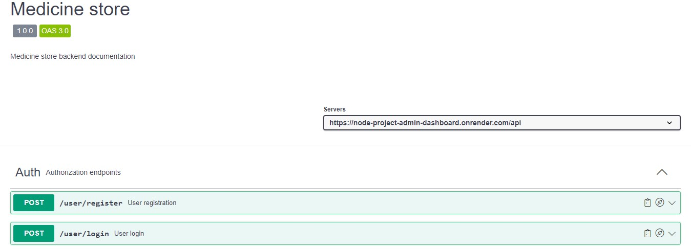

# 𝔹𝕒𝕔𝕜𝕖𝕟𝕕 𝕠𝕗 𝕄𝕖𝕕𝕚𝕔𝕚𝕟𝕖 𝕤𝕥𝕠𝕣𝕖 𝕡𝕣𝕠𝕛𝕖𝕔𝕥  

  

The backend was developed in Node.js and uploaded to the сloud application hosting Render.  

## 𝔽𝕖𝕒𝕥𝕦𝕣𝕖𝕤 𝕒𝕟𝕕 𝕋𝕖𝕔𝕙𝕟𝕠𝕝𝕠𝕘𝕚𝕖𝕤 ᎓    

  &nbsp;
  &nbsp;
  &nbsp;
  &nbsp;
  
  &nbsp;
  &nbsp;
  &nbsp;  

  Working with database, queries, and validation.  
  
 [Node.js](https://nodejs.org/): cross-platform JavaScript runtime environment.   
 [Express](https://expressjs.com/): minimalist web framework for Node.js.  
 [Cors](https://www.npmjs.com/package/cors): for providing a Connect/Express middleware.  
 [Nodemon](https://nodemon.io/): to automatically restart the server.  
 [Morgan](https://www.npmjs.com/package/morgan): HTTP request logger middleware.  
 [Mongoose](https://mongoosejs.com/): for asynchronous modeling of MongoDB database objects.  
 [Compass](https://www.mongodb.com/products/tools/compass): graphical client for working with MongoDB databases.  
 [Dotenv](https://www.npmjs.com/package/dotenv): to load an environment variable from the .env file into the process.env file.  
 [JWT](https://jwt.io/): to create (sign) and validate (verify) tokens used for user authentication/authorization.  
 [Bcryptjs](https://www.npmjs.com/package/bcryptjs): to hash and encrypt sensitive data before saving it to the database.  
 [Joi](https://www.npmjs.com/package/joi?activeTab=versions): for schema description and data validation.  
 [Dayjs](https://day.js.org/): for date manipulation.  
 [Swagger](https://readjourney.b.goit.study/api-docs/): for authorization and database.  
 [Docker](https://www.docker.com/): for application development, delivery, and operation.  
 [Bruno](https://www.usebruno.com/): innovative API client, an alternative to Postman.  

View Frontend:  

View Backend:  
  

View Swagger:  
  

Questions, suggestions, help:  

   
